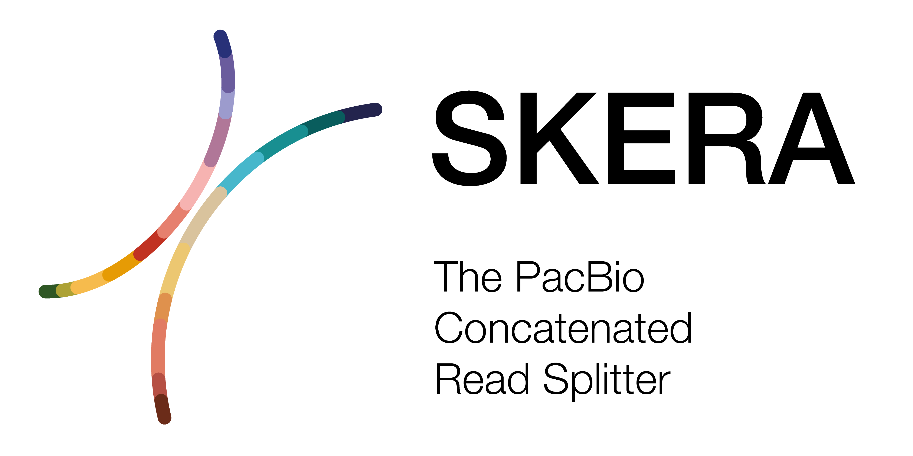

  

***

⚠️ <i>Skera</i> is currently an alpha release. Output(s), formats, and functionality are not finalized. Expect major changes.

***

_Skera_ splits arrayed PacBio reads at adapter positions generating
([read-segments](/read-segments)). For each input/parent read (e.g. HiFi)
_skera_ will create multiple bam records, one for each fragment. A parent read
can contain many fragments. _Skera_ has two major functions, split and undo.
_Skera_ undo reconstitutes the original parent read from input fragments;
_Skera_ undo is not yet implemented.

## Availability
The latest `skera` can be installed via the bioconda.

Please refer to our [official pbbioconda
page](https://github.com/PacificBiosciences/pbbioconda) for information on
Installation, Support, License, Copyright, and Disclaimer.

## Versions
Version **0.0.101**: [Full changelog here](/changelog)

## Input
### Reads
HiFi reads in PacBio BAM format.

### Adapters
Adapters must be in FASTA format `<adapters.fasta>` and ordered in the expected 
order of adapters in the reads. There should be one entry per adapter (forward 
or reverse-complement orientation) with no overlapping adapter sequences. 

## Execution
Skera run on HiFi reads in PacBio BAM format:

    skera <movie>.hifi_reads.bam adapters.fasta <movie>.skera.bam
