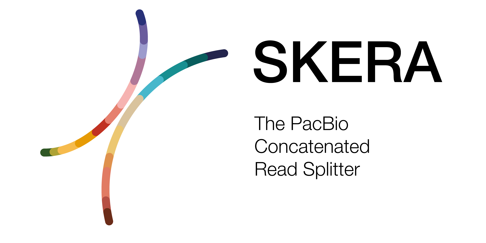

  

***

_Skera_ splits arrayed PacBio reads at adapter positions generating ([read-segments](/read-segments)). For each input/parent read (e.g. HiFi) _skera_ will create multiple bam records, one for each fragment. A parent read can be comprised on many fragments. _Skera_ has two major functions, split and undo. _Skera_ undo reconstitutes the original parent read from input fragments; _Skera_ undo is not yet implemented.

The _skera_ tool is in beta. Expect continual changes, which may change the algorithm and or the command line interface. 

## Availability
The latest version of `skera` is distributed through [BioConda](https://github.com/PacificBiosciences/pbbioconda).

## Versions
Version **0.1.0**: [Full changelog here](/change-log)
