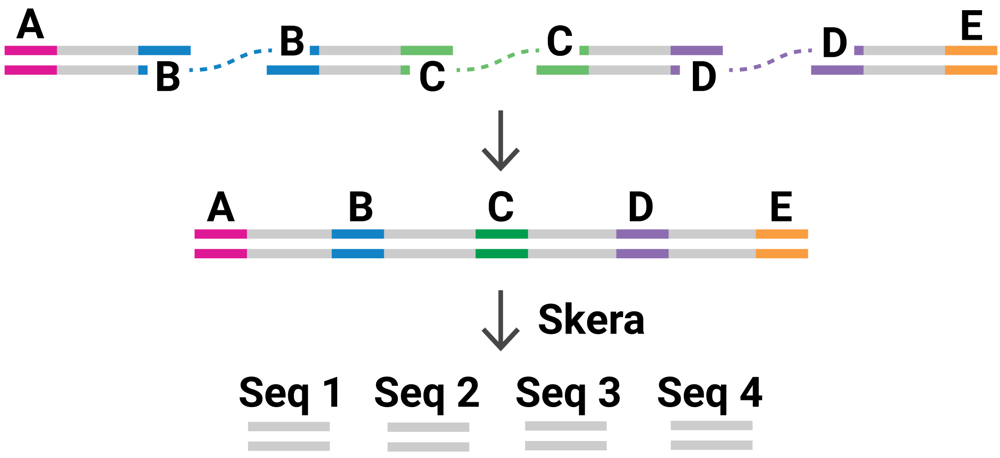

<p align="center">
  
</p>

***

## Segmented Reads

A segmented read (S-read) is comprised of multiple fragments. The figure above shows an S-read with four fragments (Seq 1..4).

## Segmented read names

For segmented reads, the base ``QNAME`` follows the CCS read conventions, while
also appending the 0-based coordinate interval ``[qStart, qEnd)`` that
represents its span within the CCS read. If the CCS read is split by strand

```
  default:
  {movieName}/{holeNumber}/ccs/{qStart}_{qEnd}

  stranded:
  {movieName}/{holeNumber}/ccs/fwd/{qStart}_{qEnd}
  {movieName}/{holeNumber}/ccs/rev/{qStart}_{qEnd}
```

| BAM tag | Type  |           Description            |     Example     |
| :-----: | :---: | -------------------------------- | :-------------- |
|  `di`   |  `i`  | Index of read segment            | `di:i:0`        |
|  `qs`   |  `i`  | qStart of segment in parent read | `qs:i:16`       |
|  `qe`   |  `i`  | qEnd of segment in parent read   | `qe:i:450`      |
|  `dl`   |  `i`  | Leading adapter index            | `dl:i:0`        |
|  `dr`   |  `i`  | Trailing adapter index           | `dr:i:1`        |
|  `ds`   |  `b`  | binary json                      | `ds:b:10,21,23` |

Notes:
 - All tags of type `i` are 0-based
 - `qs` and `qe` are left open, right closed
 - `dl` and `dr` match the ordering of adapter sequences in the user input fasta
 - `ds` contains a number of fields used for supporting _skera_ undo, not
   intended for general use
